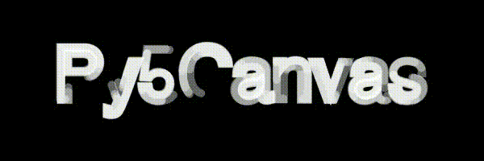

# Table of Contents

1.  [Similar projects](#org93cb45b)
2.  [Installation](#org7844890)
    1.  [Installing dependencies with Conda](#orga1f0f22)
        1.  [Auto-installing into an environment](#orge1a3cb0)
        2.  [Installing manually](#orgf388ac2)
        3.  [Updating](#org5e16e66)
    2.  [Install through pip (needs testing on Mac)](#orged21b61)
    3.  [Installing on Google colab](#org6b2ec35)
    4.  [Optional (but suggested) extensions](#org93d4241)
3.  [Usage](#orgac4e26d)
    1.  [Canvas API](#org603dfa5)
    2.  [Interactive sketches](#org1476f56)
        1.  [A basic example](#orgb7067ec)
        2.  [Main differences with JS/Java](#orga99bc84)
        3.  [Video input and output](#org7c127d3)
        4.  [Saving image or SVG output](#orgcdaf6aa)
        5.  [GUI support and parameters](#org435e5b3)
        6.  [OSC support](#org6c88408)

Py5canvas is a simple library that allows to draw 2d graphics in Python with an interface that is designed for users that are familiar to Processing and P5js.
The library is designed to work inside Jupyter notebooks and/or interactively as a &ldquo;sketch&rdquo; structured similarly to Processing.

The main idea behind this system is to facilitate the development of creative and interactive applications with Python, while enabling access to the huge number of packages available in Python echosystem. The project started with the development of a simple interface to allow students in [Goldsmiths computational arts](https://www.gold.ac.uk/pg/ma-computational-arts/) to create graphics inside notebooks with an interface similar to P5js. It has since developed into a bigger framework that implements a Phthon &ldquo;flavour&rdquo; of Processing, mainly focused towards 2d vector graphics.

Refer to [this notebook](https://github.com/colormotor/py5canvas-examples/blob/master/other/canvas_tutorial.ipynb) for an overview of using Py5canvas in a Jupyter notebook. Download or clone the code in [this example repository](https://github.com/colormotor/py5canvas-examples) for examples of interactive scripts. The latter is a fork and extension of [the examples for p5py project](https://github.com/p5py/p5-examples), another similar Python port of Processing. See below for how this project differs from p5py.

# Similar projects

This is one of a number of other ways to develop &ldquo;Processing-like&rdquo; code in Python. These are existing projects with a similar goal:

-   [p5py](https://p5.readthedocs.io/en/latest/) is perhaps the most similar and more mature than this project. It allows to write sketches with a syntax similar to processing in pure Python, and uses on [NumPy](https://numpy.org) and [VisPy](https://vispy.org) as backends. It supports different graphics backends and 3d graphics functionalities similart to Processing. However, it does not provide a Jupyter notebook interface and live reloading of scripts.
-   Processing has a [Python mode](https://py.processing.org), but this deviates from the standard way of installing Python dependencies (e.g. Pip or Conda) and makes it more challenging to take full advantage of the big echosystem of Python packages/libraries.
-   [DrawBot](https://www.drawbot.com) uses a different syntax but has a similar goal of easily &ldquo;sketching&rdquo; 2d designs in Python. It currently only runs on MacOS.

The main drive to develop this new system has been to provide a drawing interface for Python that is similar to Processing/P5js and:

-   Can be used inside Jupyter notebooks
-   Supports &ldquo;live coding&rdquo; (or more precicesely live-reloading) of interactive sketches for quicker prototyping of ideas.

While the syntax of the sketches is similar to P5js or Processing, the aim of this system is to provide a platform similar to DrawBot for interactive editing of scripts and with a focus on 2d vector graphics.

The interactive sketch system allows for the easy creation of a UI and parameter saving, which is similar in spirit to DrawBot. The syntax of sketches is almost identical to [p5py](https://p5.readthedocs.io/en/latest/), making the relevant examples and documentation a useful reference for py5canvas as well. The examples Most of these latter examples are an adaptation of Processing examples developed for a project very similar to this one taken from the example code of provided with p5py.

# Installation

While you can install py5canvas directly with pip it is recommended to create a
conda environment and pre-install the dependencies using conda.

## Installing dependencies with Conda

The main requirements for Py5Canvas are [NumPy](https://numpy.org), [pyCairo](https://pycairo.readthedocs.io/en/latest/)  [pyGLFW](https://github.com/FlorianRhiem/pyGLFW) and [moderngl](https://moderngl.readthedocs.io/en/5.8.2/). pyGLFW and ModernGL are only necessary if you use interactive sketches, but these will be automatically installed with the procedure described in the next section. To fully use the Canvas API with video input, you will also need [OpenCV](https://opencv.org), The instructions below include it, but it is not essential.

The dependency installation procedure depends on the [conda package mananger](https://docs.conda.io/en/latest/). With many different options, one ideal way to install conda is to use the reduced [miniforge](https://github.com/conda-forge/miniforge) installer (saves disk space). To speed up installation, it is recommended to install [mamba](https://mamba.readthedocs.io/en/latest/) alongside conda (since &ldquo;vanilla&rdquo; conda is written in Python and can be extremely slow). Once a version of conda is installed, install mamba with:

    conda install conda-forge::mamba

Afterwards, you can pretty much replace any use of `conda` with `mamba` and things will go significantly faster.

### Auto-installing into an environment

You might want to create a conda Python environment before going forward, which means you will be able to install the dependencies without interfering with your base Python installation. To do so you can do rapidly you can do:

    conda env create --name py5 -f https://raw.githubusercontent.com/colormotor/py5canvas/main/environment.yaml

and then

    conda activate py5

Then install py5canvas from pip with

    pip install py5canvas

### Installing manually

First create the environment

    conda env create -n py5 python=3.10

Then install the dependencies

    conda install -c conda-forge numpy pycairo jupyter opencv pyglfw moderngl

And finally install py5canvas with pip as above, or from source with either:

    pip install git+https://github.com/colormotor/py5canvas.git

Or by cloning the repository and then from its directory

    pip install -e .

### Updating

If you installed from PyPi (with pip) install the latest version with:

    pip install --upgrade py5canvas

If you installed from source (pip+git) but not locally update to the latest version with:

    pip install --upgrade  --force-reinstall --no-deps git+https://github.com/colormotor/py5canvas.git

## Install through pip 

While the whole package can be installed with

    pip install py5canvas

This can cause problems on mac with pyCairo, which at this time does not install the required C++ libraries when installed with pip.

## Installing on Google colab

To install on Google Colab, and Linux if you don&rsquo;t want to use conda

    !apt-get install libcairo2-dev libjpeg-dev libgif-dev
    !pip install py5canvas

## Optional (but suggested) extensions

2.  Open Sound Control (OSC)

    The sketch interface also provides optional OSC functionality through the  [python-osc](https://pypi.org/project/python-osc/) module. This enables communication with other software that supports the protocol. It can be installed with:
    
        pip install python-osc
    
    See the relevant section below for usage details.

# Usage

## Canvas API

Once installed you can use the py5canvas API in a notebook (or Python program) by simply importing it. This is a simple example that will save an image and show it below the notebook cell:

    from py5canvas import *
    # Create our canvas object
    create_canvas(512, 512)
    # Clear background to black
    background(0)
    # Set stroke only and draw circle
    stroke(128)
    no_fill()
    stroke_weight(5)
    circle(width/2, height/2, 100)
    # Draw red text
    fill(255, 0, 0)
    no_stroke()
    text_size(30)
    text("Hello world", [width/2, 40], center=True)
    show()

In general, the syntax is very similar to P5js but it uses `snake_case` as a syntax convention. The canvas functions become available to the notebook cell once `create_canvas` is created. Note that this is a hack to expose a functionality as similar as possible to Processing. However, under the hood py5canvas creates a `Canvas` object that can be also accessed explicitly if desired. For more detailed instructions refer to [this notebook](https://github.com/colormotor/py5canvas/blob/main/examples/canvas_tutorial.ipynb).

Note also that the Canvas object is intended to be a simple interface on top of [pyCairo](https://pycairo.readthedocs.io/en/latest/), but it does not expose all the functionalities of the API. If necessary, these can be accessed with the `ctx` class variable.

## Interactive sketches

While the Canvas API alone does not supprt interactivity, you can run interactive sketches with a program structure similar to P5js and Processing.

### A basic example

Let&rsquo;s look at a simple example (`basic_animation.py`) that generates a rotating circle that leaves a trail behind

    from py5canvas import *
    
    def setup():
        create_canvas(512, 512)
    
    def draw():
        background(0, 0, 0, 8) # Clear with alpha will create the "trail effect"
        push()
        # Center of screen
        translate(c.width/2, c.height/2)
        # Draw rotating circle
        fill(255, 0, 0)
        stroke(255)
        rotate(sketch.frame_count*0.05)
        circle(100, 0, 20)
        pop()
    
    run()

Similarly to P5js and Processing, the sketch revolves around two functions: `setup` and a `draw`. The first is called once and can be used to setup the sketch. The second is called every frame and can be used to update our animation. The first line `from py5canvas import *` setups the script with all the functionalities of py5canvas, and the `run()` statement sets up the loop that will run the program.

To run this script simply run it from your editor, if it is configured to do so (e.g. [Visual Studio Code](https://code.visualstudio.com)), or run the script from
the command line

    python basic_animation.py

This will open a window with the sketch. If `run()` is not preceded by a `if __name__=='__main__':` statement, any change to the script file will reload it in the window. 

### Main differences with JS/Java

In general the structure and syntax of a sketch is very similar to P5js or Processing. The main difference is the &ldquo;snakecase&rdquo; convention, so function and variable names have words separated by underscores and not capitals. As an example the function `createCanvas` will be `create_canvas` instead. Similarly, you can equivalently use `size` instead of the `createCanvas` function.

However, there are a number of differences to take into account.

1.  Globals

    Differently from Javascript or Java, Python does not allow modifications to globals from within a function by default. For example this code snippet
    
        foo = 10
        def draw():
            print(foo)
            foo += 1
    
    will print the value of `foo` but incrementing the variable will not work. To make this work we need to explicitly declare
    `foo` as a global. In the following example we declare two variables as globals allowing the function to modify both.
    
        foo = 10
        bar = 20
        def draw():
            global foo, bar
            foo += 1
            bar -= 1
    
    1.  Avoiding globals with a container
    
        One way to avoid having to declare globals every time is to put the parameters that can be modified within a function inside a container. As an example, we could use an anonymous function or an [EasyDict](https://pypi.org/project/easydict/) dictionary. The anonymous function trick would be as follows:
        
            params = lambda: None
            params.foo = 10
            params.bar = 20
            
            def draw():
                params.foo += 1
                params.bar -= 1
        
        An alternative, that is also useful to automatically create a GUI and save/load parameters is using [EasyDict](https://pypi.org/project/easydict/), which allows accessing elements of a dictionary without using quotes:
        
            from easydict import EasyDict as edict
            params = edict({
                'foo': 10,
                'bar': 20 })
            
            def draw():
                params.foo += 1
                params.bar -= 1
        
        Refer to the section on GUI and parameters to see how this can also be used to handle sketch parameters.

2.  Converting a p5js sketch

    One quick and dirty way to convert a p5js sketch to a Python py5sketch is to use ChatGPT. This prompt seems to work relatively well
    
    > Convert this code to Python using camel case instead of snake case, but keeping exactly the same function and variable names, don&rsquo;t capitalize variables:
    
    Followed by the p5js code.
    The [L-system](https://github.com/colormotor/py5canvas/blob/main/examples/l_system.py) and [spirograph](https://github.com/colormotor/py5canvas/blob/main/examples/spirograph.py) examples have been converted this way from the p5js example library, with little to no modifications.

3.  The `sketch` and `canvas` objects

    Behind the hood a sketch uses two main components: A `sketch` object that
    handles the script running and updates and a `sketch.canvas` object that handles
    drawing 2d graphics.
    
    By default, the py5canvas program exposes the methods of these objects as
    globals, so it is not necessary to reference these objects explicitly. This is
    useful for rapidly prototyping simple scripts, but it can become problematic as program complexity grows. As an example, while easy to remember,
    function names like `scale`, `rotate` etc, these are quite common words and it is easy
    to overwrite them by mistake while writing a script. Take this sketch as an example:
    
        from py5canvas import *
        scale = 1.0
        
        def setup():
            create_canvas(512, 512)
        
        def draw():
            background(0)
            translate(width/2, height/2)
            scale(0.5)
            circle(0, 0, 100*scale)
        
        run()
    
    it won&rsquo;t work because the variable `scale` has been dynamically replaced with the canvas function `scale()` and the last line will try to multiply a function with a number!
    
    To overcome this issue, we can access the canvas functionalities instead by referring to the `sketch.canvas` object (assigning it to a variable `c` for
    brevity). So the following will work:
    
        from py5canvas import *
        scale = 1.0
        
        def setup():
            sketch.create_canvas(512, 512)
        
        def draw():
            c = sketch.canvas
            c.background(0)
            c.translate(c.width/2, c.height/2)
            c.scale(0.5)
            c.circle(0, 0, 100)
        
        run(inject=False)
    
    Here we explicitly state in `run` that the code should not be injected, and we have access to the functionalities through the `sketch` and `sketch.canvas` interfaces.

### Video input and output

With OpenCV installed, the py5sketch systems allows to read the webcam stream, play videos and to save videos of the sketch output.

1.  Playing video

    To show the webcam input or to play a video, you need to use the `VideoInput` object. It takes one optional parameter that is either the video input device number (`0` is the default) or the name of a file to play. See [the video input example](https://github.com/colormotor/py5canvas/blob/main/examples/video_input.py) for details.

2.  Saving video or image sequences

    To save a specified number of frames as a video or as an image sequence, use the the
    `sketch.grab_movie(filename, num_frames, framerate)` and `sketch.grab_image_sequence(directory_name, num_frames)` functions. As an example, calling `sketch.grab_move("frames.mp4", 200, 30)` will save a 30 FPS mp4 movie of 200 frames. Both functions have an optional argument `reload` that is set to `True`. If `reload` is `True`, the script is reloaded when saving so the video will start from the first frame. This is particularly useful when saving loops. If `reload=False`, the video will start recording from the next frame without reloading.

### Saving image or SVG output

All vector drawing operations for a given frame, can be exported to SVG by using the GUI (if [PyImGui](https://pypi.org/project/imgui/#files) is installed), or by using the `sketch.save_canvas(filename)` function.
Note that once called, the **next** frame will be saved.

### GUI support and parameters

The `py5sketch` program can be used in combination with the [Python bindings](https://pypi.org/project/imgui/#files) of [Dear ImGui](https://github.com/ocornut/imgui), an [&ldquo;immediate mode&rdquo; UI](https://pyimgui.readthedocs.io/en/latest/guide/first-steps.html#what-is-immediate-mode-gui) built on top of OpenGL. A basic usage example of IMGUI can be found in the `imgui_test.py` example.

1.  Default UI

    If pyImGui is installed, the `py5sketch` program will feature a basic toolbar. The toolbar allows to:
    
    -   Load a sketch
    -   Backup a sketch
    -   Reload the current sketch
    -   Save the output for the current sketch as a SVG file.
    
    &ldquo;Backing up a sketch&rdquo; means that the current sketch, and its parameters (see the following) will be saved with the name specified. This can be useful to save the current iteration of a sketch while continuing to work on the code. E.g. say you are working on a sketch and realize you like the results, but this is not the final result you where trying to achieve. You can &ldquo;backup&rdquo; the sketch and then eventually go back to the code later, while continue working on the current sketch and not risking to destroy the achieved result.

2.  Parameters and automatic GUI

    While one can use the immediate mode paradigm to create a dynamic UI in the `draw` function, it is also possible to automatically create an UI for a given number of parameters.
    The parameters are defined by passing returning a dictionary from the a custom defined `parameters()` function, e.g.:
    
        def parameters():
            return {'Width': (100, {'min': 10, 'max': 200}),
                  'Height': (100, {'min': 10, 'max': 200}),
                  'rectangle color': ([255, 0, 0], {'type':'color'})}
    
    Or with the more concise syntax:
    
        def parameters():
            return {'Width': (100.0, 10.0, 200.0),
                  'Height': (100.0, 10.0, 200.0),
                  'rectangle color': ([255, 0, 0], {'type':'color'})}
    
    The parameters will be then accessible in the script through the `params` variable.
    
    
    
    This syntax defines the parameters as a dictionary. Internally this will be converted to a more convenient [EasyDict](https://pypi.org/project/easydict/) structure, that allows the parameters to be accessed with dot notation through the `params` object, e.g. `params.width` or `params.rectangle_color` for the example above. Note that the parameter names we defined contain spaces and capitals. **These will be automatically converted to names that are all lower-case and with spaces replaced by underscores.** The names originally specified will instead appear by deault as labels when the GUI is created.
    
    You can create groups/subparameters (also in the GUI) by adding an entry to the dictionary that is a dictionary itself. See the `parameters.py` script for an example.
    
    1.  Saving and loading
    
        The `py5sketch` program will automatically save and load the parameters when reloading a sketch or closing the program. However, note that the parameters will NOT be saved if the script has an error.
    
    2.  Presets
    
        When parameters are defined as above, the UI will automatically show a &ldquo;Presets&rdquo; header. Typing a name in the &ldquo;Name&rdquo; input field will allow to save a presets with the given name.
    
    3.  Showing the GUI
    
        If parameters are defined, an UI for the parameters will be visualized on the right of the canvas. The window will be resized so it can fit the canvas of the specified size together with the UI. You can specify the size of the UI (e.g. for accommodating longer parameter names) by specifying the optional `gui_width` parameter when calling `create_canvas`. E.g.:
        
            def setup():
                create_canvas(512, 512, gui_width=300)
        
        Will add `300` pixels to the window width in order to show a column containing the parameter UI.
    
    4.  Parameter widget types
    
        When automatically creating a GUI, the `py5sketch` program uses the type of the parmameter and options to infer what widget will be visualized:
        
        1.  Boolean
        
            -   Widget: **Checkbox**
            -   Options: None
        
        2.  Integer
        
            -   Widget: Integer input field, Integer slider or Combo (dropdown selection).
            -   Options:
                -   **Value box** (no options specified)
                -   **Slider** (`min` and `max` options are specified)
                -   **Combo** (`selection` is specified with a list of strings)
        
        3.  Float
        
            -   Widget: Float input field or Float slider
            -   Options:
                -   **Value box** (no options specified)
                -   **Slider** (`min` and `max` options are specified)
        
        4.  String
        
            -   Widget: Single-line or multi-line text input field
            -   Options:
                -   Maximum buffer length, `buf_length` key in opts (default to: `1024`)
                -   **Multiline text input** if the `multiline:True` option is defined.
        
        5.  Callable (the name of a function)
        
            -   Widget: **Button**
            -   Options: None
        
        6.  Float Array
        
            -   Widget: Value boxes, sliders or a color picker
            -   Options:
                -   **Color selector** if the `type='color'` option is specified. The length of the array must be 3 or 4.
                -   **Sliders** if the `min` and `max` options are specified
                -   **Value boxes** if no options are specified
        
        7.  Integer Array
        
            -   Widget: Value boxes, sliders or a color picker
            -   Options:
                -   **Sliders** if the `min` and `max` options are specified
                -   **Value boxes** if no options are specified

3.  Auto saving

    Creating parameters as described above will result in the parameters being automatically saved and loaded every time a sketch is reloaded. The parameters will be saved to a JSON file having the same name and directory as the sketch script.

### OSC support

If [python-osc](https://pypi.org/project/python-osc/) is installed, py5sketch automatically initializes an OSC server and client.
By default, the client will run on localhost address (127.0.0.1) with port 9998,
and the server will listen on port 9999 for any incoming OSC message.

You can configure these parameters from the GUI or by creating an `settings_osc.json` file that is located in the same directory as the script.
A default setup would look like this

    {
        'recv_port': 9999,
        'send_address': 'localhost',
        'send_port': '9998'
    }

These parameters will not change until you restart py5sketch.

If a `received_osc(addr, value)` function is defined in the sketch, this will be automatically called any time an OSC message is received, with `addr` containing the messsage address (as a string) and `value` containing the message contents.

To send an osc message at any time, use the `sketch.send_osc(addr, value)`.

See the <./examples/osc_example.py> script and the <./examples/osc_example.maxpat> Max MSP patch for a usage example.

